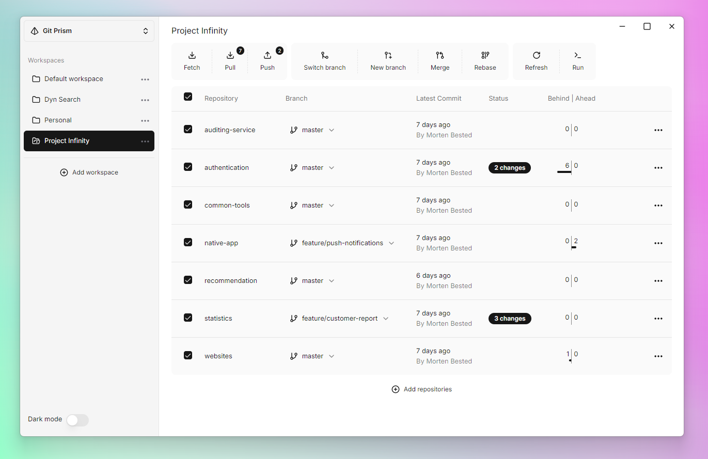
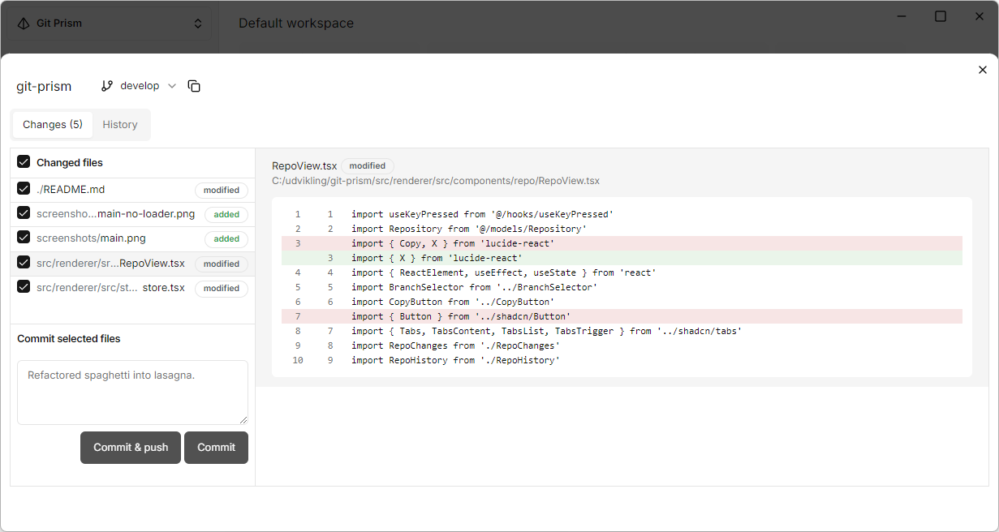
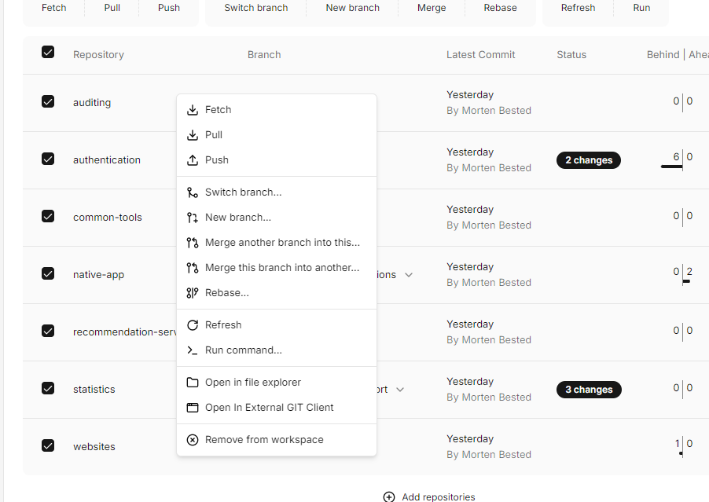
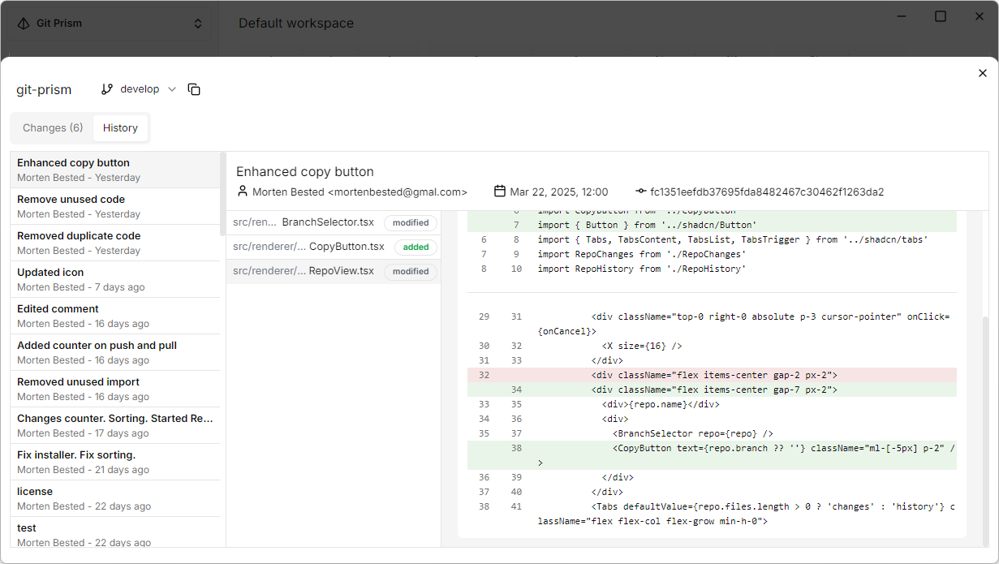
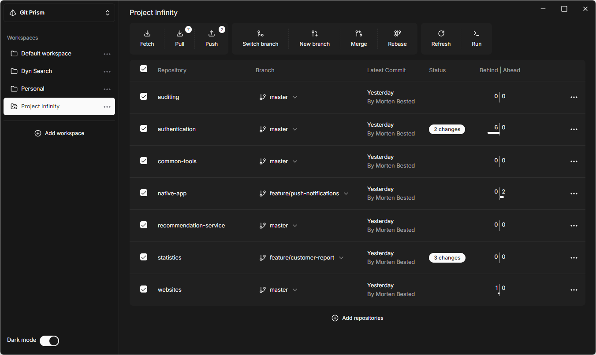

# Git Prism – One view, total control 🦄

Git Prism is a git client built to simplify the management of projects with multiple repositories. Keep track of branches, uncommitted changes, and pending pulls across all repositories. Execute commands such as pull on multiple repositories with a single button.

## ✨ Features
- **Batch Commands**: Perform commands on multiple repositories at once.
- **Branch Tracking**: View ahead/behind status for each repository.
- **Change Overview**: Get a clear overview of which repositories has uncommitted changes.
- **Workspaces**: Organize repositories into workspaces (projects).
- **Commit Window**: Commit and push changes.
- **History Browsing**: Browse commit history of a repository.
- **Dark Theme**: Dark mode for better visual comfort.

##  Screenshots
### Commit Window
See local changes and commit to the repository.

### Context Menu
Quickly perform actions on a single repository using the context menu (right-click).

### Browse History
Explore the commit history with ease.

### Dark Mode
Switch to dark mode for a better visual experience.

## Limitations
- Clone not supported. You'll need to clone repositories using another Git client, then add them manually via the 'Add Repositories' button.
- Adding tags is not supported.
- Currently tested on Windows. Built with Electron, so Linux and macOS should work, but are untested.
- Submodules or subtrees have not been considered. 

## 📜 License
This project is licensed under the MIT License - see the [LICENSE](LICENSE) file for details.
